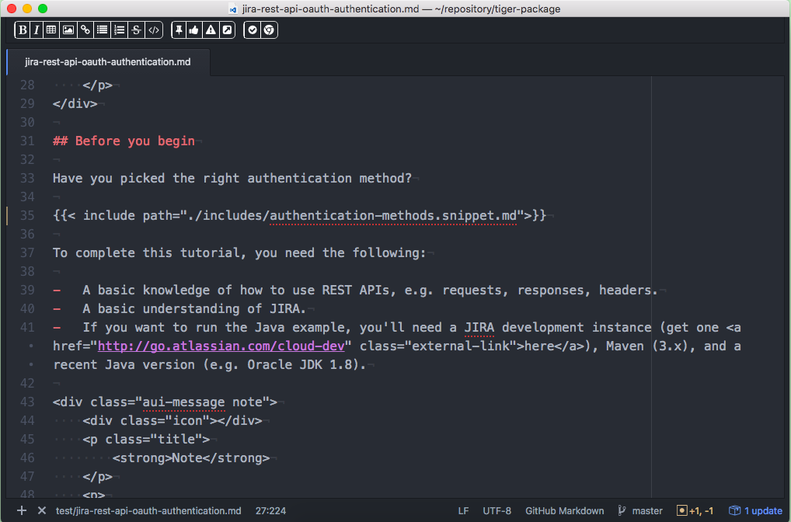
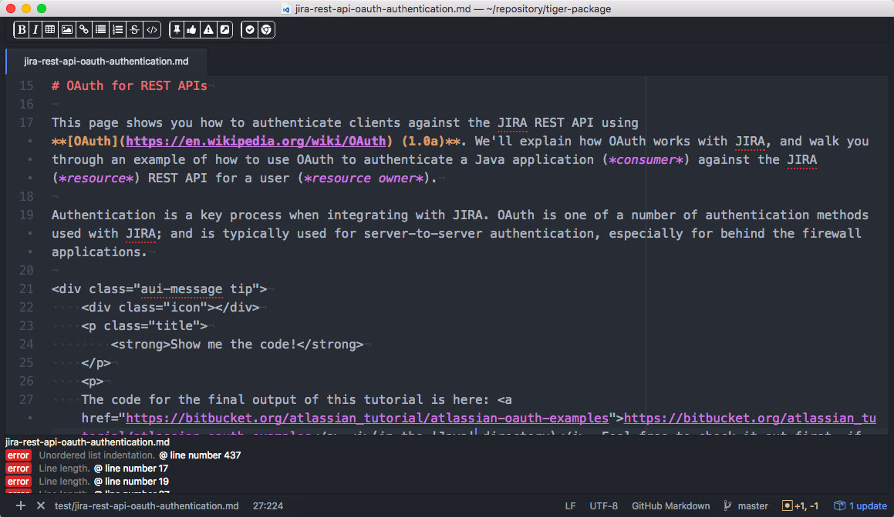
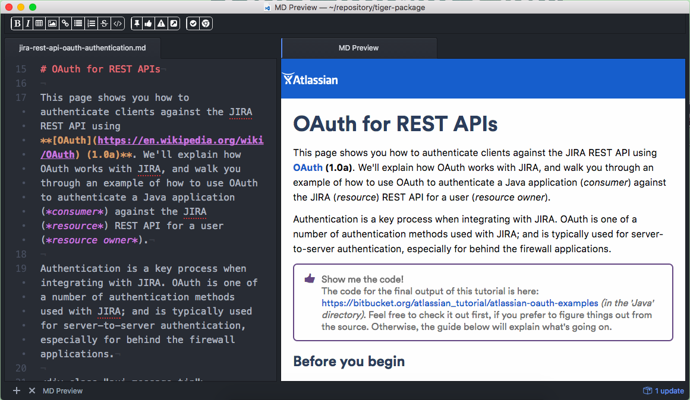

# Technical Writer's IDE
Everything a tech writer needs to write your markdown docs and make shit go.

## Features

### Markdown Toolbar

### Markdown Validator

### Previewer

## Roadmap
* JIRA | Trello Task List Integration
  * Show your tasks
  * Allow you to update and close tasks
  * Scan the page and create tasks for keywords : TODO-JIRA:
* Grammar Checker
  * Integrate a Grammar API for doc validation
* Visual Github integration
    * Use the d3js library to show a visual representation of bitbucket branches (http://bl.ocks.org/mbostock/4339083)
    * allow to commit and merge branches by dragging streams together.
