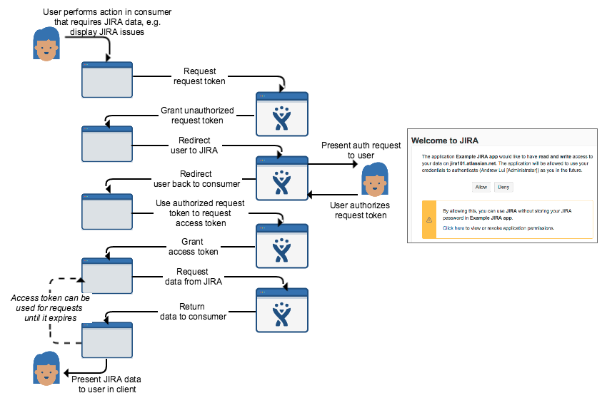
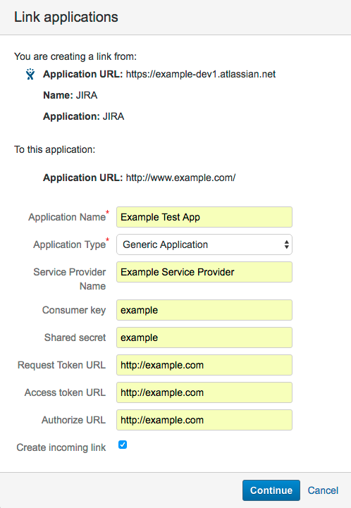
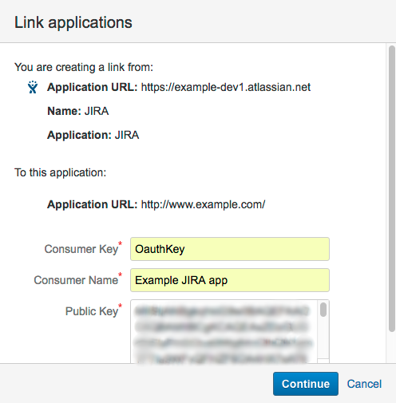
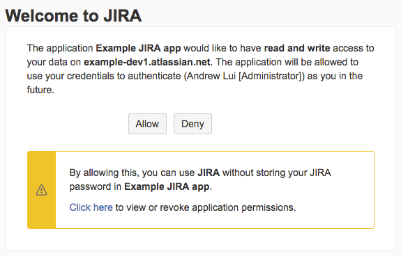

# OAuth for REST APIs

This page shows you how to authenticate clients against the JIRA REST API using **[OAuth](https://en.wikipedia.org/wiki/OAuth) (1.0a)**. We'll explain how OAuth works with JIRA, and walk you through an example of how to use OAuth to authenticate a Java application (*consumer*) against the JIRA (*resource*) REST API for a user (*resource owner*).

Authentication is a key process when integrating with JIRA. OAuth is one of a number of authentication methods used with JIRA; and is typically used for server-to-server authentication, especially for behind the firewall applications.

<div class="aui-message tip">
    <div class="icon"></div>
    <p class="title">
        <strong>Show me the code!</strong>
    </p>
    <p>
    The code for the final output of this tutorial is here: <a href="https://bitbucket.org/atlassian_tutorial/atlassian-oauth-examples">https://bitbucket.org/atlassian_tutorial/atlassian-oauth-examples</a> <i>(in the 'Java' directory)</i>. Feel free to check it out first, if you prefer to figure things out from the source. Otherwise, the guide below will explain what's going on.
    </p>
</div>

## Before you begin

Have you picked the right authentication method?



To complete this tutorial, you need the following:

-   A basic knowledge of how to use REST APIs, e.g. requests, responses, headers.
-   A basic understanding of JIRA.
-   If you want to run the Java example, you'll need a JIRA development instance (get one <a href="http://go.atlassian.com/cloud-dev" class="external-link">here</a>), Maven (3.x), and a recent Java version (e.g. Oracle JDK 1.8).

<div class="aui-message note">
    <div class="icon"></div>
    <p class="title">
        <strong>Note</strong>
    </p>
    <p>
    This tutorial was last tested with <strong>JIRA Cloud (1000.319.1) / JIRA Server 7.0</strong>.
    </p>
</div>

## Overview

OAuth is an authentication protocol that allows a user (*resource owner*) to grant a third-party application (*consumer/client*) access to their information on another site (*resource*). JIRA uses **3-legged OAuth (3LO)**, which means that the user is involved in the authentication process by authorizing access to their data on the resource (as opposed to 2-legged OAuth, where the user is not involved).

### Roles

These are the roles in the OAuth authentication process, and how they relate to authenticating with JIRA:

|              |                 |
|--------------|-----------------|
| **Resource**<br>| If you are integrating a client application with JIRA, then JIRA is considered to be the "resource". |
| **Resource owner**<br> | As JIRA is the "resource", the JIRA user is considered to be the "resource owner" for an authentication request. |
| **Consumer**<br> | The client application is registered as a consumer, by creating an application link (that uses OAuth) in JIRA that links to the client. |

### Process

The authentication process, commonly known as the "OAuth dance", works by getting the resource owner to grant access to their information on the resource, by authenticating a request token. This request token is used by the consumer to obtain an access token from the resource. Once the client has an access token, it can use it to make authenticated requests to the resource until the token expires or is revoked.

This process is shown in more detail in the diagram below:


## See it in action

Let's see how the OAuth authentication process actually works, before we look at the code. This will be a hands-on walkthrough, where you'll configure JIRA so that the sample client can authenticate against it using OAuth. You'll also be using the sample client to initiate the "OAuth dance", then finally make an authenticated request to the JIRA REST API.

In this section:

-   [Before you begin](before-you-begin-1)
-   [Step 1. Configure your client application as an OAuth consumer](#step-1-configure-your-client-application-as-an-oauth-consumer)
-   [Step 2. Do the OAuth dance](#step-2-do-the-oauth-dance)
-   [Step 3. Make an authenticated request to the JIRA REST API](#step-3-make-an-authenticated-request-to-the-jira-rest-api)

### Before you begin

-   If you haven't gotten the sample OAuth client application code yet, clone it from here: <a href="https://bitbucket.org/atlassian_tutorial/atlassian-oauth-examples" class="uri" class="external-link">https://bitbucket.org/atlassian_tutorial/atlassian-oauth-examples</a> (in the 'Java' directory).
-   Once you have the code, build the client by running the following command in the root of the project:

    ``` bash
    mvn clean compile assembly:single
    ```
-   Navigate to the **target** directory in the project and run:

    ``` javascript
    java -jar OAuthTutorialClient-1.0.jar requestToken
    ```
    Ignore the exception in the output for now. We just need to do this to generate the **config.properties** file that we'll use later.

### Step 1. Configure your client application as an OAuth consumer

In JIRA, OAuth consumers are represented by **application links**. Application links use OAuth with RSA-SHA1 signing for authentication. This means that a private key is used to sign requests, rather than the OAuth token secret/consumer secret. In the following steps, you'll be generating an RSA public/private key pair, then creating a new application link in JIRA that uses the key.

**Generate an RSA public/private key pair:**

1.  In your terminal, run the following <a href="https://www.openssl.org/docs/manmaster/apps/" class="external-link">openssl</a> commands. You can do this anywhere in your file system.

    ``` bash
    openssl genrsa -out jira_privatekey.pem 1024
    openssl req -newkey rsa:1024 -x509 -key jira_privatekey.pem -out jira_publickey.cer -days 365
    openssl pkcs8 -topk8 -nocrypt -in jira_privatekey.pem -out jira_privatekey.pcks8
    openssl x509 -pubkey -noout -in jira_publickey.cer  > jira_publickey.pem
    ```
    This generates a 1024-bit private key, creates an X509 certificate, and extracts the private key (PKCS8 format) to the **jira\_privatekey.pcks8** file. It then extracts the public key from the certificate to the **jira\_publickey.pem** file.
2.  Copy the private key from the **jira\_privatekey.pcks8** file to your clipboard.
3.  Navigate to the **target** directory in the sample OAuth client project. Edit the **config.properties** file and make the following changes:
    -   Paste the private key from your clipboard over the value of `private_key` field. Remove all line breaks.
    -   Change the `jira_home` to the URL of your JIRA development instance, e.g. `https://example-dev1.atlassian.net`
    -   Don't change the **`consumer_key`, which should be set to 'OauthKey'.

4.  Save the **config.properties** file.

**Configure the client app as a consumer in JIRA, using application links:**

1.  In JIRA, navigate to **cog icon** (![]) &gt; **Applications** &gt; **Application links**.
2.  In the field, '*Enter the URL of the application you want to link*', enter any URL, e.g. http://example.com/ and click **Create new link**.
    You'll get a warning that '*No response was received from the URL you entered*'. Ignore it and click **Continue**.
3.  On the first screen of the **Link applications** dialog, enter anything you want in the fields. However, make sure you tick the **Create incoming link** checkbox.<br>
    
    *Note, in this example, it doesn't matter what you enter for the client application details (URL, name, type, etc). This is because we only want to retrieve data from JIRA, therefore we only need to set up a one-way (incoming) link from the client to JIRA.*
4.  The next screen of the **Link applications** dialog is where you enter the consumer details for the sample client. Set it to the following values:
    -   **Consumer key** = OauthKey
    -   **Consumer name** = Example JIRA app
    -   **Public key** = &lt;*Copy the public key from the jira\_publickey.pem file you generated previously and paste it into this field&gt;*<br>
        
5.  Click **Continue**. You should end up with an application link that looks like like this:<br>
    

That's it! You've now configured the sample client as an OAuth consumer in JIRA.

### Step 2. Do the OAuth dance

The "OAuth dance" is a term that's used to describe the process of getting an access token from the resource, that the consumer can use to access information on the resource. This involves a "dance" where different tokens are passed between the consumer, resource owner, and resource (see [OAuth overview](#oauth-overview) above).

1.  In your terminal, navigate to the **target** directory of the sample OAuth client project, if you are not already there.
2.  Run the following command. This command requests an unauthorized request token from your JIRA instance.

    ``` bash
    java -jar OAuthTutorialClient-1.0.jar requestToken
    ```

    You'll see the following output with the details of your new request token:

    ``` bash
    Token:            ec3dj4byySM5ek3XW7gl7f4oc99obAlo
    Token Secret:   OhONj0eF7zhXAMKZLbD2Rd3x7Dmxjy0d
    Retrieved request token. go to https://jira101.atlassian.net/plugins/servlet/oauth/authorize?oauth_token=ec3dj4byySM5ek3XW7gl7f4oc99obAlo to authorize it
    ```

    The request token will persist for 10 minutes. If it expires, you'll need to request a new one.

3.  In your browser, go to the URL specified in the output. You'll see the following dialog:
    
4.  Click **Allow**. This will authorize the request token.
    You'll see the following output in your browser:

    ``` javascript
    Access Approved
    You have successfully authorized 'Example JIRA app'. Your verification code is 'qTJkPi'. You will need to enter this exact text when prompted. You should write this value down before closing the browser window.
    ```

    Copy the verification code to your clipboard or somewhere else where you can get it.

5.  In your terminal, run the following command. You'll need to replace the example verification code ("`qTJkPi`") with your own verification code from the previous step.

    ``` bash
    java -jar OAuthTutorialClient-1.0.jar accessToken qTJkPi
    ```

    You'll see the following output in your terminal:

    ``` bash
    Access Token:         W1jjOV4sq2iEqxO4ZYZTJVdgbjtKc2ye
    ```

    Note, in OAuth, you actually need to pass the consumer key, request token, verification code, and private key, to get the access token. However, in the sample client, information like the consumer key, request token, private key, etc, are stored in the **config.properties** file when they are generated (have a look at it, as you complete this tutorial and you'll see the new values added). You probably don't want to do this for a production implementation, but this makes the sample client easier to use for this example.

We now have what we wanted from the OAuth dance: an access token that we can use to make an authenticated request to the JIRA REST API.

### Step 3. Make an authenticated request to the JIRA REST API

An access code is all that we need to make an authenticated request to the JIRA REST API. Requests are made as the user who authorized the initial request token. The access token will persist for 5 years, unless it is revoked.

The sample OAuth client only makes GET requests, but it's simple to use. Just run the following command. You'll need to substitute `<URL for REST method>` with the URL of the REST method that you are trying to call.

``` bash
java -jar OAuthTutorialClient-1.0.jar request <URL for GET method>
```

In the code, the sample OAuth client actually stores the access code in the **config.properties** file when it is obtained. When a request is made, the sample client passes the stored access code, rather than you having to enter it.

Here's an example of a request to get an issue, using the sample OAuth client -- the following command gets the issue, JJ-2, via the JIRA REST API:

``` bash
java -jar OAuthTutorialClient-1.0.jar request https://example-dev1.atlassian.net/rest/api/latest/issue/JJ-2
```

The above method returns an issue like this:

``` javascript
 {
   "expand": "renderedFields,names,schema,operations,editmeta,changelog,versionedRepresentations",
   "self": "<a href="https://example-dev1.atlassian.net/rest/api/latest/issue/10300">https://example-dev1.atlassian.net/rest/api/latest/issue/10300</a>",
   "id": "10300",
   "fields": {
     "issuetype": {
       "avatarId": 10803,
       "name": "Bug",
       "self": "<a href="https://example-dev1.atlassian.net/rest/api/2/issuetype/1">https://example-dev1.atlassian.net/rest/api/2/issuetype/1</a>",
       "description": "A problem which impairs or prevents the functions of the product.",
       "id": "1",
       "iconUrl": "<a href="https://example-dev1.atlassian.net/secure/viewavatar?size=xsmall&amp;avatarId=10803&amp;avatarType=issuetype">https://example-dev1.atlassian.net/secure/viewavatar?size=xsmall&amp;avatarId=10803&amp;avatarType=issuetype</a>",
       "subtask": false
     },
     "timespent": null,
     "project": {
       "avatarUrls": {
         "48x48": "<a href="https://example-dev1.atlassian.net/secure/projectavatar?pid=10200&amp;avatarId=10700">https://example-dev1.atlassian.net/secure/projectavatar?pid=10200&amp;avatarId=10700</a>",
         "24x24": "<a href="https://example-dev1.atlassian.net/secure/projectavatar?size=small&amp;pid=10200&amp;avatarId=10700">https://example-dev1.atlassian.net/secure/projectavatar?size=small&amp;pid=10200&amp;avatarId=10700</a>",
         "16x16": "<a href="https://example-dev1.atlassian.net/secure/projectavatar?size=xsmall&amp;pid=10200&amp;avatarId=10700">https://example-dev1.atlassian.net/secure/projectavatar?size=xsmall&amp;pid=10200&amp;avatarId=10700</a>",
         "32x32": "<a href="https://example-dev1.atlassian.net/secure/projectavatar?size=medium&amp;pid=10200&amp;avatarId=10700">https://example-dev1.atlassian.net/secure/projectavatar?size=medium&amp;pid=10200&amp;avatarId=10700</a>"
       },
       "name": "JIRA Junior",
       "self": "<a href="https://example-dev1.atlassian.net/rest/api/2/project/10200">https://example-dev1.atlassian.net/rest/api/2/project/10200</a>",
       "id": "10200",
       "key": "JJ"
     },
     "fixVersions": [],
     "aggregatetimespent": null,
     "resolution": null,
     "customfield_10500": null,
     "customfield_10700": "com.atlassian.servicedesk.plugins.approvals.internal.customfield.ApprovalsCFValue@c8d588",
     "resolutiondate": null,
     "workratio": -1,
     "lastViewed": "2016-08-01T11:23:39.481+1000",
     "watches": {
       "self": "<a href="https://example-dev1.atlassian.net/rest/api/2/issue/JJ-2/watchers">https://example-dev1.atlassian.net/rest/api/2/issue/JJ-2/watchers</a>",
       "isWatching": true,
       "watchCount": 1
     },
     "created": "2013-05-29T13:56:24.224+1000",
     "customfield_10020": null,
     "customfield_10021": "Not started",
     "priority": {
       "name": "Major",
       "self": "<a href="https://example-dev1.atlassian.net/rest/api/2/priority/3">https://example-dev1.atlassian.net/rest/api/2/priority/3</a>",
       "iconUrl": "<a href="https://example-dev1.atlassian.net/images/icons/priorities/major.svg">https://example-dev1.atlassian.net/images/icons/priorities/major.svg</a>",
       "id": "3"
     },
     "customfield_10300": null,
     "customfield_10102": null,
     "labels": [],
     "customfield_10016": null,
     "customfield_10017": null,
     "customfield_10018": null,
     "customfield_10019": null,
     "timeestimate": null,
     "aggregatetimeoriginalestimate": null,
     "versions": [],
     "issuelinks": [],
     "assignee": {
       "emailAddress": "alana@<a href="http://example.com">example.com</a>",
       "avatarUrls": {
         "48x48": "<a href="https://secure.gravatar.com/avatar/b259e2a7fd37a83b02015192ee247e96?d=mm&amp;s=48">https://secure.gravatar.com/avatar/b259e2a7fd37a83b02015192ee247e96?d=mm&amp;s=48</a>",
         "24x24": "<a href="https://secure.gravatar.com/avatar/b259e2a7fd37a83b02015192ee247e96?d=mm&amp;s=24">https://secure.gravatar.com/avatar/b259e2a7fd37a83b02015192ee247e96?d=mm&amp;s=24</a>",
         "16x16": "<a href="https://secure.gravatar.com/avatar/b259e2a7fd37a83b02015192ee247e96?d=mm&amp;s=16">https://secure.gravatar.com/avatar/b259e2a7fd37a83b02015192ee247e96?d=mm&amp;s=16</a>",
         "32x32": "<a href="https://secure.gravatar.com/avatar/b259e2a7fd37a83b02015192ee247e96?d=mm&amp;s=32">https://secure.gravatar.com/avatar/b259e2a7fd37a83b02015192ee247e96?d=mm&amp;s=32</a>"
       },
       "displayName": "Alana Example",
       "name": "alana",
       "self": "<a href="https://example-dev1.atlassian.net/rest/api/2/user?username=alana">https://example-dev1.atlassian.net/rest/api/2/user?username=alana</a>",
       "active": true,
       "timeZone": "Australia/Sydney",
       "key": "alana"
     },
     "updated": "2016-08-01T11:23:38.022+1000",
     "status": {
       "name": "Open",
       "self": "<a href="https://example-dev1.atlassian.net/rest/api/2/status/1">https://example-dev1.atlassian.net/rest/api/2/status/1</a>",
       "description": "The issue is open and ready for the assignee to start work on it.",
       "iconUrl": "<a href="https://example-dev1.atlassian.net/images/icons/statuses/open.png">https://example-dev1.atlassian.net/images/icons/statuses/open.png</a>",
       "id": "1",
       "statusCategory": {
         "colorName": "blue-gray",
         "name": "To Do",
         "self": "<a href="https://example-dev1.atlassian.net/rest/api/2/statuscategory/2">https://example-dev1.atlassian.net/rest/api/2/statuscategory/2</a>",
         "id": 2,
         "key": "new"
       }
     },
     "components": [],
     "timeoriginalestimate": null,
     "description": "The logo is currently a light cerise. I'd like to see it with a deep pink color.",
     "customfield_10012": null,
     "customfield_10013": null,
     "customfield_10014": null,
     "timetracking": {},
     "customfield_10015": null,
     "customfield_10600": null,
     "customfield_10006": "10",
     "customfield_10601": null,
     "customfield_10007": [
       "com.atlassian.greenhopper.service.sprint.Sprint@dc6300[id=1,rapidViewId=&lt;null&gt;,state=CLOSED,name=Sprint 1,goal=&lt;null&gt;,startDate=2013-07-26T11:31:09.530+10:00,endDate=2013-08-09T11:31:09.530+10:00,completeDate=2013-07-26T11:31:46.489+10:00,sequence=1]",
       "com.atlassian.greenhopper.service.sprint.Sprint@6b3e17[id=2,rapidViewId=&lt;null&gt;,state=ACTIVE,name=Sprint 2,goal=&lt;null&gt;,startDate=2013-08-22T11:35:33.759+10:00,endDate=2013-12-12T11:35:00.000+11:00,completeDate=&lt;null&gt;,sequence=2]"
     ],
     "customfield_10008": null,
     "attachment": [],
     "aggregatetimeestimate": null,
     "summary": "JIRA Junior logo is not pink enough",
     "creator": {
       "emailAddress": "admin@<a href="http://example.com">example.com</a>",
       "avatarUrls": {
         "48x48": "<a href="https://secure.gravatar.com/avatar/4beac5df66a475580809e0?d=mm&amp;s=48">https://secure.gravatar.com/avatar/4beac5df66a475580809e0?d=mm&amp;s=48</a>",
         "24x24": "<a href="https://secure.gravatar.com/avatar/4beac5df66a475580809e0?d=mm&amp;s=24">https://secure.gravatar.com/avatar/4beac5df66a475580809e0?d=mm&amp;s=24</a>",
         "16x16": "<a href="https://secure.gravatar.com/avatar/4beac5df66a475580809e0?d=mm&amp;s=16">https://secure.gravatar.com/avatar/4beac5df66a475580809e0?d=mm&amp;s=16</a>",
         "32x32": "<a href="https://secure.gravatar.com/avatar/4beac5df66a475580809e0?d=mm&amp;s=32">https://secure.gravatar.com/avatar/4beac5df66a475580809e0?d=mm&amp;s=32</a>"
       },
       "displayName": "Administrator",
       "name": "admin",
       "self": "<a href="https://example-dev1.atlassian.net/rest/api/2/user?username=admin">https://example-dev1.atlassian.net/rest/api/2/user?username=admin</a>",
       "active": true,
       "timeZone": "Australia/Sydney",
       "key": "admin"
     },
     "subtasks": [],
     "reporter": {
       "emailAddress": "admin@<a href="http://example.com">example.com</a>",
       "avatarUrls": {
         "48x48": "<a href="https://secure.gravatar.com/avatar/4beac5df66a475580809e0?d=mm&amp;s=48">https://secure.gravatar.com/avatar/4beac5df66a475580809e0?d=mm&amp;s=48</a>",
         "24x24": "<a href="https://secure.gravatar.com/avatar/4beac5df66a475580809e0?d=mm&amp;s=24">https://secure.gravatar.com/avatar/4beac5df66a475580809e0?d=mm&amp;s=24</a>",
         "16x16": "<a href="https://secure.gravatar.com/avatar/4beac5df66a475580809e0?d=mm&amp;s=16">https://secure.gravatar.com/avatar/4beac5df66a475580809e0?d=mm&amp;s=16</a>",
         "32x32": "<a href="https://secure.gravatar.com/avatar/4beac5df66a475580809e0?d=mm&amp;s=32">https://secure.gravatar.com/avatar/4beac5df66a475580809e0?d=mm&amp;s=32</a>"
       },
       "displayName": "Administrator",
       "name": "admin",
       "self": "<a href="https://example-dev1.atlassian.net/rest/api/2/user?username=admin">https://example-dev1.atlassian.net/rest/api/2/user?username=admin</a>",
       "active": true,
       "timeZone": "Australia/Sydney",
       "key": "admin"
     },
     "customfield_10000": null,
     "aggregateprogress": {
       "total": 0,
       "progress": 0
     },
     "customfield_10001": null,
     "customfield_10200": "0|10001s:",
     "customfield_10002": null,
     "customfield_10003": null,
     "customfield_10400": null,
     "environment": null,
     "duedate": null,
     "progress": {
       "total": 0,
       "progress": 0
     },
     "comment": {
       "total": 1,
       "comments": [{
         "author": {
           "emailAddress": "admin@<a href="http://example.com">example.com</a>",
           "avatarUrls": {
             "48x48": "<a href="https://secure.gravatar.com/avatar/4beac5df66a475580809e0?d=mm&amp;s=48">https://secure.gravatar.com/avatar/4beac5df66a475580809e0?d=mm&amp;s=48</a>",
             "24x24": "<a href="https://secure.gravatar.com/avatar/4beac5df66a475580809e0?d=mm&amp;s=24">https://secure.gravatar.com/avatar/4beac5df66a475580809e0?d=mm&amp;s=24</a>",
             "16x16": "<a href="https://secure.gravatar.com/avatar/4beac5df66a475580809e0?d=mm&amp;s=16">https://secure.gravatar.com/avatar/4beac5df66a475580809e0?d=mm&amp;s=16</a>",
             "32x32": "<a href="https://secure.gravatar.com/avatar/4beac5df66a475580809e0?d=mm&amp;s=32">https://secure.gravatar.com/avatar/4beac5df66a475580809e0?d=mm&amp;s=32</a>"
           },
           "displayName": "Administrator",
           "name": "admin",
           "self": "<a href="https://example-dev1.atlassian.net/rest/api/2/user?username=admin">https://example-dev1.atlassian.net/rest/api/2/user?username=admin</a>",
           "active": true,
           "timeZone": "Australia/Sydney",
           "key": "admin"
         },
         "created": "2013-06-04T16:11:24.505+1000",
         "updateAuthor": {
           "emailAddress": "admin@<a href="http://example.com">example.com</a>",
           "avatarUrls": {
             "48x48": "<a href="https://secure.gravatar.com/avatar/4beac5df66a475580809e0?d=mm&amp;s=48">https://secure.gravatar.com/avatar/4beac5df66a475580809e0?d=mm&amp;s=48</a>",
             "24x24": "<a href="https://secure.gravatar.com/avatar/4beac5df66a475580809e0?d=mm&amp;s=24">https://secure.gravatar.com/avatar/4beac5df66a475580809e0?d=mm&amp;s=24</a>",
             "16x16": "<a href="https://secure.gravatar.com/avatar/4beac5df66a475580809e0?d=mm&amp;s=16">https://secure.gravatar.com/avatar/4beac5df66a475580809e0?d=mm&amp;s=16</a>",
             "32x32": "<a href="https://secure.gravatar.com/avatar/4beac5df66a475580809e0?d=mm&amp;s=32">https://secure.gravatar.com/avatar/4beac5df66a475580809e0?d=mm&amp;s=32</a>"
           },
           "displayName": "Administrator",
           "name": "admin",
           "self": "<a href="https://example-dev1.atlassian.net/rest/api/2/user?username=admin">https://example-dev1.atlassian.net/rest/api/2/user?username=admin</a>",
           "active": true,
           "timeZone": "Australia/Sydney",
           "key": "admin"
         },
         "self": "<a href="https://example-dev1.atlassian.net/rest/api/2/issue/10300/comment/10100">https://example-dev1.atlassian.net/rest/api/2/issue/10300/comment/10100</a>",
         "id": "10100",
         "body": "Hi [~william] JIRA is *super fun* (see JJ-1). Alana is going to fix the logo.",
         "updated": "2013-06-12T21:55:34.882+1000"
       }],
       "maxResults": 1,
       "startAt": 0
     },
     "votes": {
       "hasVoted": false,
       "self": "<a href="https://example-dev1.atlassian.net/rest/api/2/issue/JJ-2/votes">https://example-dev1.atlassian.net/rest/api/2/issue/JJ-2/votes</a>",
       "votes": 0
     }
   },
   "key": "JJ-2"
 }
```

 Congratulations! You now know how to use OAuth to make an authenticated request to the JIRA REST API.

## Development tips

You can implement OAuth in a number of ways, depending on what you are building. However, we encourage you to browse the source code for our sample Java OAuth client to get an idea of how it is implemented, regardless of the technologies that you are using.

In addition, you'll find a number of general tips below that should be helpful, regardless of how you are implementing OAuth.

-   **Use OAuth libraries**: Rather than implement everything yourself, there are a number of OAuth libraries that you can use at [Code at OAuth.net]. The sample OAuth client is using the [Google OAuth Client Library for Java].
-   **OAuth 2.0 is not supported**: Currently only OAuth 1.0a is supported for authenticating to the JIRA REST APIs.
-   **Requests for tokens must be made using HTTP POST.**
-   **Set the callback to 'oob' (out of band) when creating the request token if you want to show the token secret to the user:** See `getAndAuthorizeTemporaryToken` in **JIRAOAuthClient.java** in the sample OAuth client for an example of this. You can then set the callback to some other URL after the user authorizes the token, so that JIRA sends the token and secret to that URL.
-   **Pass the OAuth access token in the request header, not request body, when making requests:** If you pass the OAuth data in the request body, it will return a "400 Bad Request" error for most methods. You must pass the data in the header instead, e.g. "`Authorization: Bearer {access_token}`"

## Next steps

-   Read [Security overview]: Learn the difference between authentication and authorization, and how users are authorized in JIRA.
-   Check out the JIRA REST APIs:
    -   [JIRA Cloud platform REST API]
    -   [JIRA Software Cloud REST API]
    -   [JIRA Service Desk Cloud REST API]

  [Authentication for add-ons]: /cloud/jira/platform/addon-authentication
  [cookie-based authentication]: /cloud/jira/platform/jira-rest-api-cookie-based-authentication
  [basic authentication]: /cloud/jira/platform/jira-rest-api-basic-authentication
  []: (./img/cog-icon.png)
  [Code at OAuth.net]: https://oauth.net/code/
  [Google OAuth Client Library for Java]: https://developers.google.com/api-client-library/java/google-oauth-java-client/
  [Security overview]: /cloud/jira/platform/security-overview
  [JIRA Cloud platform REST API]: https://docs.atlassian.com/jira/REST/cloud/
  [JIRA Software Cloud REST API]: https://docs.atlassian.com/jira-software/REST/cloud/
  [JIRA Service Desk Cloud REST API]: https://docs.atlassian.com/jira-servicedesk/REST/cloud/
